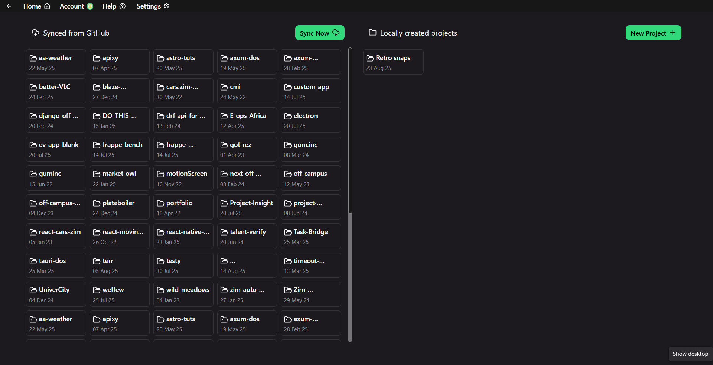
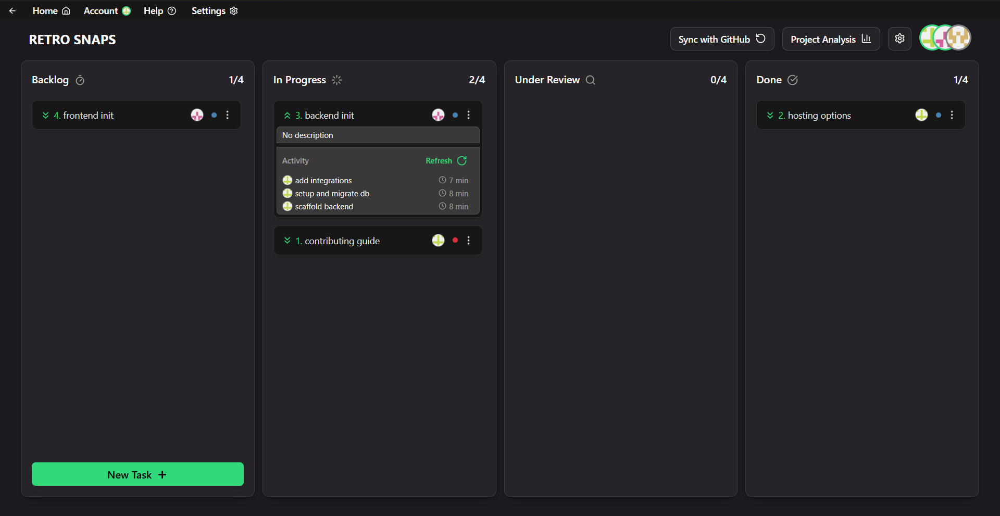
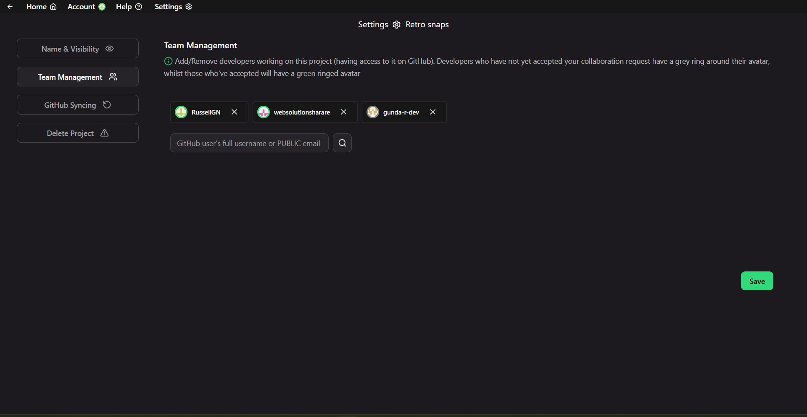

# Task-Bridge

**Task-Bridge** is a desktop-based project management solution built on top of GitHub. It simplifies work management & project oversight for GitHub-averse project managers.

Screenshots - v2.3.0

 

<table>
  <tr>
    <td align="center" width="50%">
       
    </td>
    <td align="center" width="50%">
       
    </td>
  </tr>
  <tr>
    <td align="center">
       
    </td>
    <td align="center">
       
    </td>
  </tr>
  <tr>
    <td align="center">
       
    </td>
    <td align="center">
       
    </td>
  </tr>
  <tr>
    <td align="center">
       
    </td>
  </tr>
</table>

## Download

[Download latest (recommended)](https://github.com/russellgn/task-bridge/releases/latest)  
Previous documented versions are available under [Releases](https://github.com/russellgn/task-bridge/releases).  
Older undocumented versions are available [here](https://drive.google.com/drive/folders/1i988b_XsgcZ_Q5wK7dM5CCH7DYNJDwfV?usp=sharing).  

⚠️ **Important**  
Older versions may be buggier and less stable.  
Always enable `uninstall first` and `clear previous data` options when switching between versions (will be improved in future).
 
 
[See license](./LICENSE)
