# Task-Bridge

**Task-Bridge** is a desktop-based project management solution. It is built specifically around GitHub, and is meant to simplify work management & project oversight for GitHub-averse project managers.

Screenshots @ V0.7.2-alpha

 

<table>
  <tr>
    <td align="center" width="50%">
      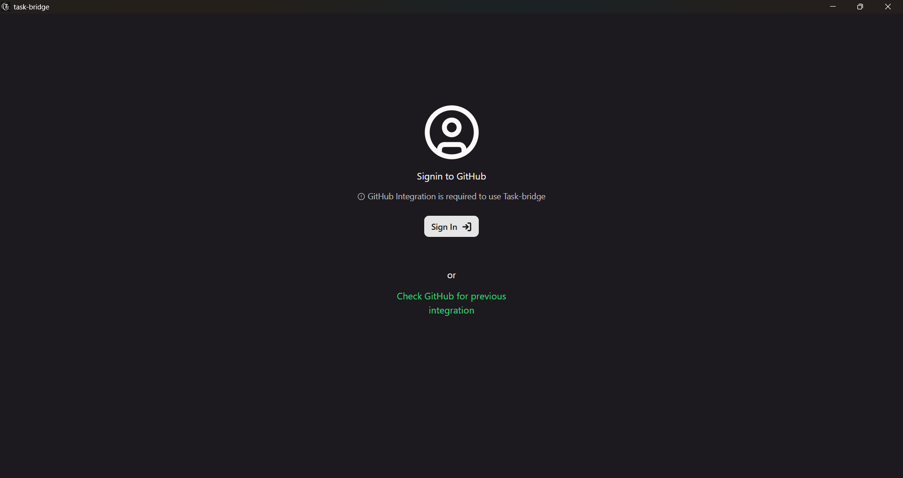 
      <em>Sign In – authorize Task-Bridge</em>
    </td>
    <td align="center" width="50%">
      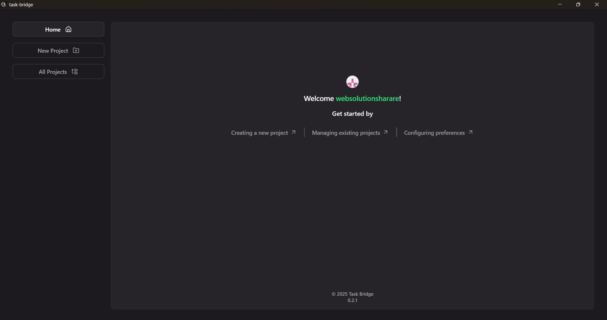 
      <em>Home – welcome notes and actions</em>
    </td>
  </tr>
  <tr>
    <td align="center">
      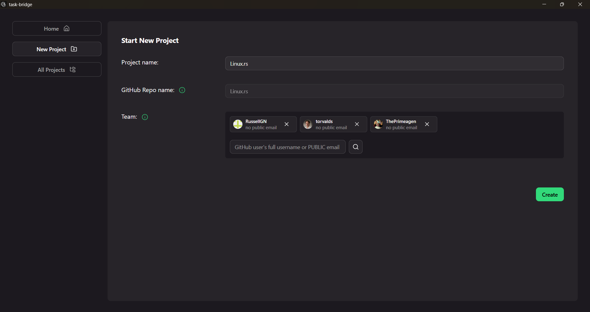 
      <em>New Project Wizard – project creation</em>
    </td>
    <td align="center">
      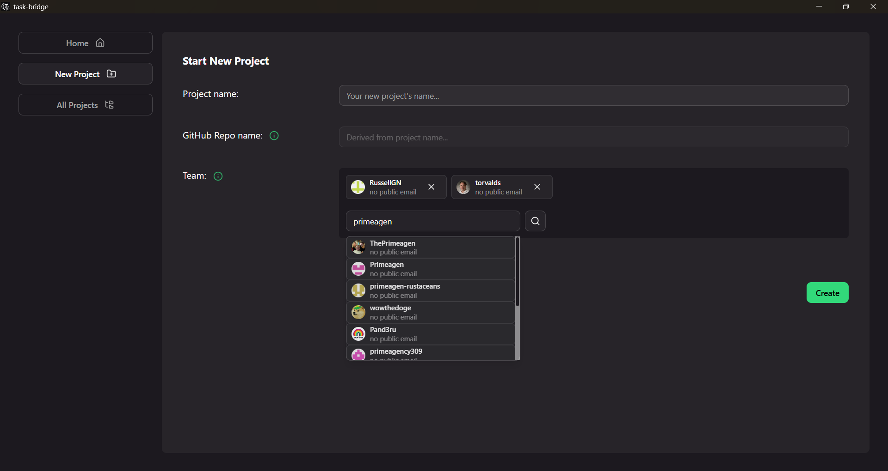 
      <em>Team Selector – GitHub collaborator invitations</em>
    </td>
  </tr>
  <tr>
    <td align="center">
      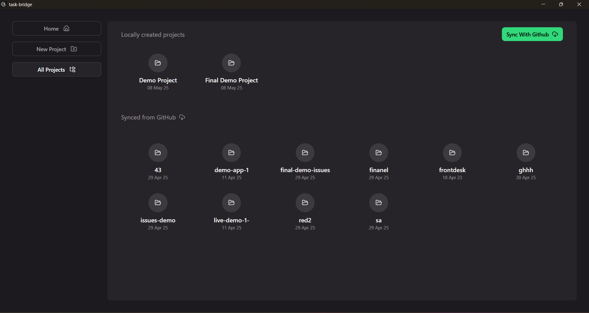 
      <em>All Projects – local and synced</em>
    </td>
    <td align="center">
      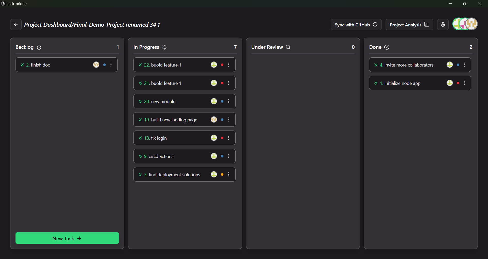 
      <em>Dashboard – main project view</em>
    </td>
  </tr>
  <tr>
    <td align="center">
      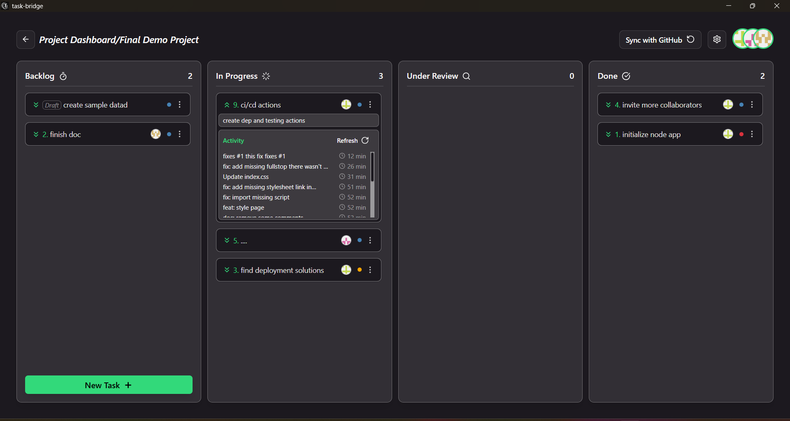 
      <em>Dashboard – expanded task view</em>
    </td>
    <td align="center">
      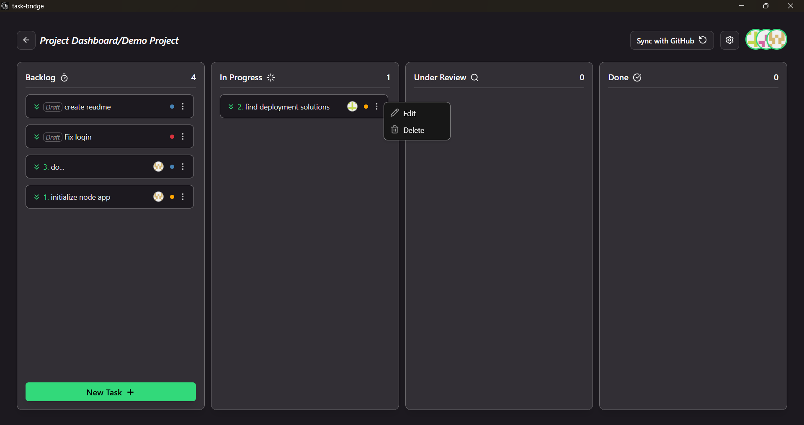 
      <em>Task Actions – task context menu</em>
    </td>
  </tr>
  <tr>
    <td align="center">
      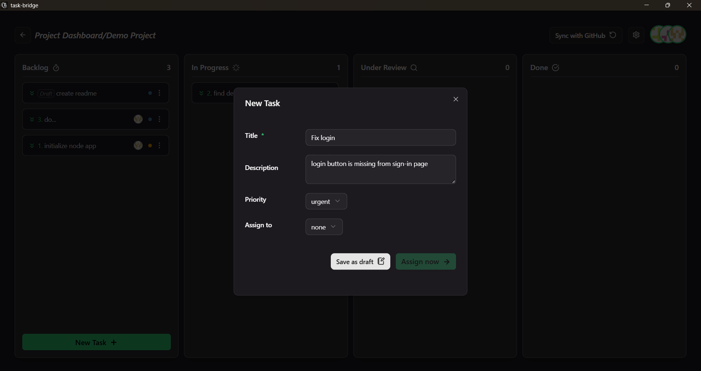 
      <em>Draft Modal – draft task input</em>
    </td>
    <td align="center">
      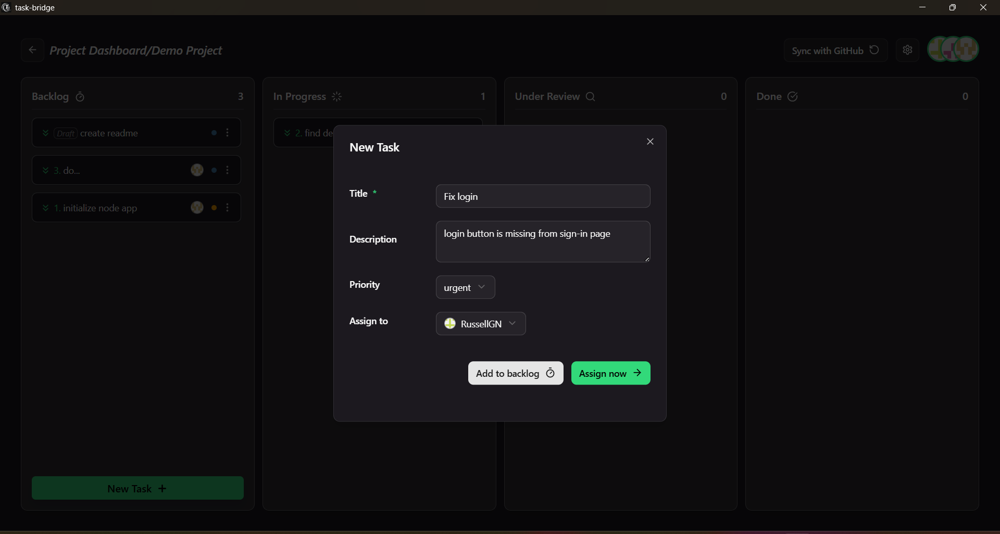 
      <em>Task Modal – task creation and assignment</em>
    </td>
  </tr>
  <tr>
    <td align="center">
      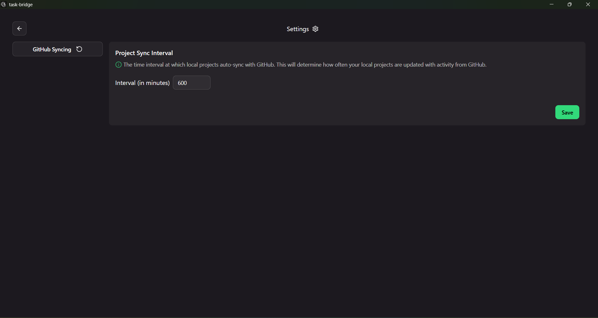 
      <em>Preferences – global project sync interval</em>
    </td>
    <td align="center">
      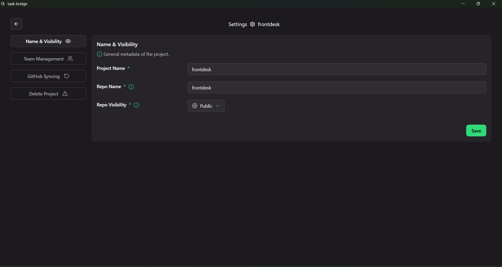 
      <em>Project Settings – general options</em>
    </td>
  </tr>
  <tr>
    <td align="center">
      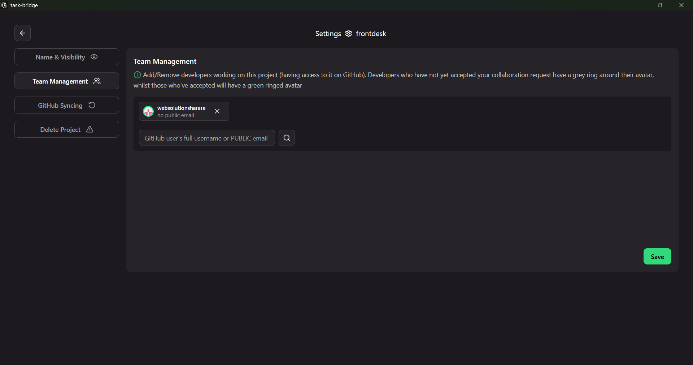 
      <em>Project Settings – team management</em>
    </td>
    <td align="center">
       
      <em>Project Settings – sync interval</em>
    </td>
  </tr>
  <tr>
    <td align="center">
      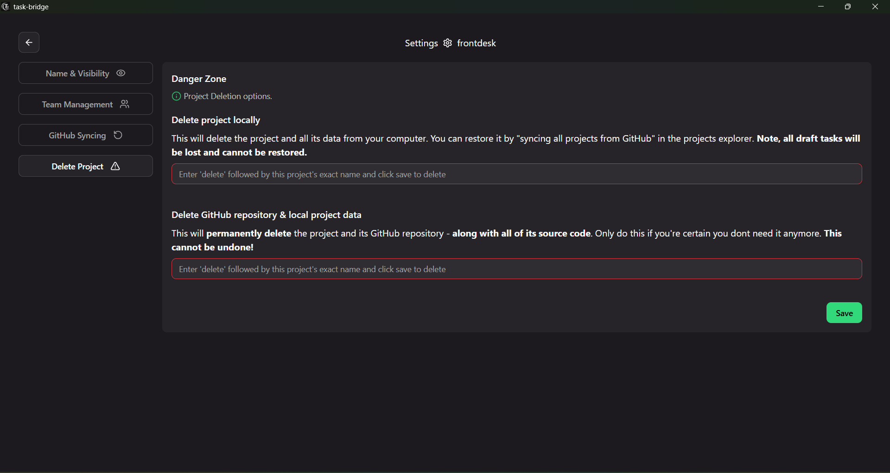 
      <em>Project Settings – delete options</em>
    </td>
    <td align="center">
      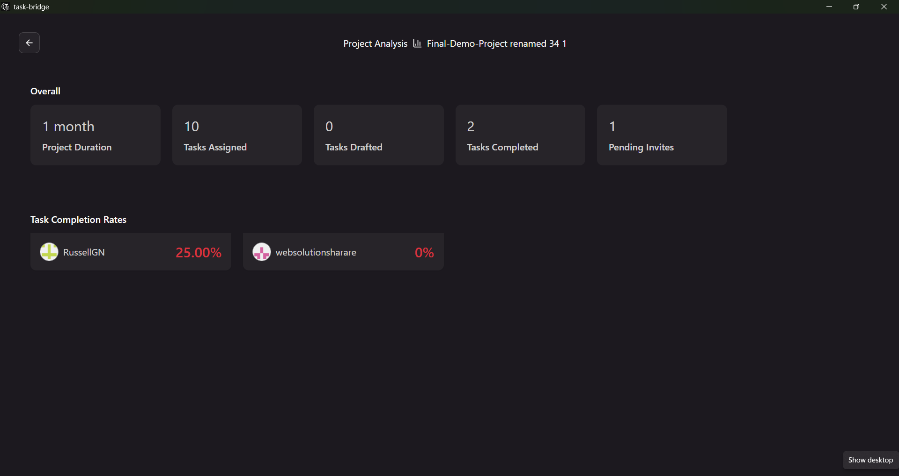 
      <em>Project Analytics – insights and stats</em>
    </td>
  </tr>
</table>

## Download

You can view and download all documented versions of the app from the [GitHub Releases](https://github.com/russellgn/task-bridge/releases) section. [Or Go to latest.](https://github.com/russellgn/task-bridge/releases/latest)  
Some older versions are not listed in the releases section, but are available [here](https://drive.google.com/drive/folders/1i988b_XsgcZ_Q5wK7dM5CCH7DYNJDwfV?usp=sharing).  

⚠️ **Important**  
Install the latest patched version. Older versions may be buggier and less stable.  
Always enable `uninstall first` and `clear previous data` options when switching between versions.
 
 
This repo is not open source. [See license](./LICENSE)
