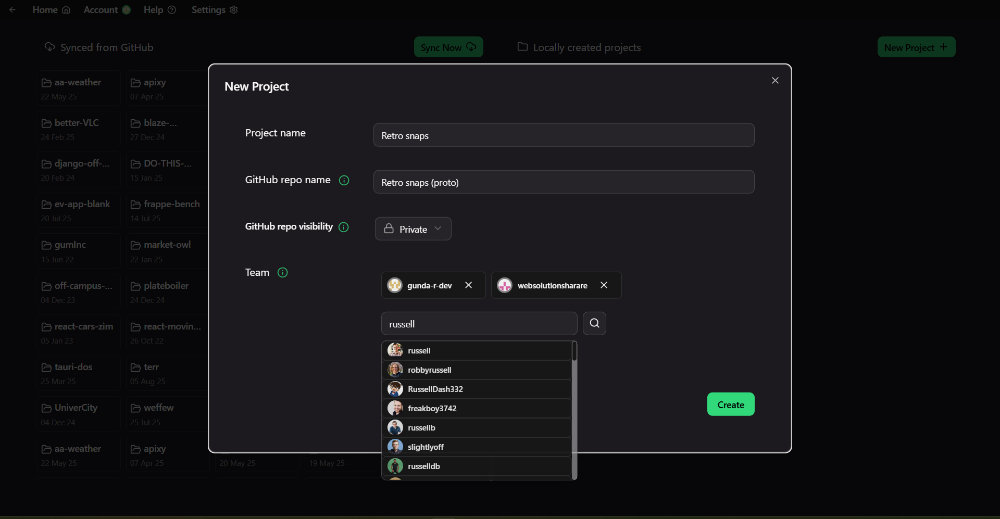

# Task-Bridge

**Task-Bridge** is a project management solution with deep integration to GitHub. It stands out by simplifying development-team management and software-project oversight for non-technical or GitHub-averse project managers. It does this through an abstracted, simple and intuitive desktop interface.

## 🖼️ Screenshots (version 0.2.1)

<table>
  <tr>
    <td align="center" width="50%">
       
      <em>Home – welcoming notes and actions</em>
    </td>
    <td align="center" width="50%">
       
      <em>New Project Wizard – project creation</em>
    </td>
  </tr>
  <tr>
    <td align="center">
       
      <em>Team Selector – GitHub collaborator invitations</em>
    </td>
    <td align="center">
       
      <em>All Projects – local and synced</em>
    </td>
  </tr>
  <tr>
    <td align="center">
       
      <em>Dashboard – task items, team view, and alerts</em>
    </td>
    <td align="center">
       
      <em>Dashboard – expanded task view</em>
    </td>
  </tr>
  <tr>
    <td align="center">
       
      <em>Task Actions – task context menu </em>
    </td>
    <td align="center">
       
      <em>Draft Modal – draft task input</em>
    </td>
  </tr>
  <tr>
    <td align="center" colspan="2">
       
      <em>Task Modal – task creation and assignment</em>
    </td>
  </tr>
</table>

## 📦 Downloads

> ℹ️ Installer will auto-remove previous versions if already installed.  
> ⏳ More installer types and platform support incoming.

| Version   | Installer Type | Download                                                                                          |
| --------- | -------------- | ------------------------------------------------------------------------------------------------- |
| 0.2.1     | `.exe` Win x64 | [Download](https://drive.google.com/file/d/1XI9tVnHW7JyUa4jfFLigqLLXeXrCBtOk/view?usp=sharing)    |
| **0.2.0** | `.exe` Win x64 | [Download](https://drive.google.com/file/d/1FNBvpDKaqSXnAgo1h4ri_UdSpwgHJpbu/view?usp=sharing)    |
|           | `.msi` Win x64 | [Download](https://drive.google.com/file/d/1koKslaq4qAgqOFpORTB1O_70doT8ue56/view?usp=sharing)    |
| 0.1.3     | `.exe` Win x64 | [Download](https://drive.google.com/file/d/1MLNidOC_NK7fdzWmBLe-UQ6H3ffY8JN_/view?usp=sharing)    |
| 0.1.2     | `.exe` Win x64 | [Download](https://drive.google.com/file/d/1flfbZxCKgx1WUdIZOL_AqrSLGQT4s1W4/view?usp=sharing)    |
| 0.1.1     | `.exe` Win x64 | [Download](https://drive.google.com/file/d/1w77MKRZRLQA_9iyh8JFPZuuvPpzTDQwD/view?usp=sharing)    |
| **0.1.0** | `.exe` Win x64 | [Download](https://drive.google.com/file/d/15zUAJfXZvFTM3Ot_8-BOZT3a8TbyVHOw/view?usp=sharing)    |
|           | `.msi` Win x64 | [Download](https://drive.google.com/file/d/1Z1APL9f9ZQtc1rI6qgXeQCacOZJHrn86/view?usp=sharing)    |
| 0.0.5     | `.exe` Win x64 | [Download](https://drive.google.com/file/d/1tLKWTlLjOZbV7KQpmly7489m24exTlrQ/view?usp=sharing)    |
| 0.0.4     | `.exe` Win x64 | [Download](https://drive.google.com/file/d/1kW6miYVPxriU9l4--WAD199lWM_5q5ct/view?usp=sharing)    |
| 0.0.3     | `.exe` Win x64 | _No longer available_                                                                             |
| 0.0.2     | `.exe` Win x64 | [Download](https://drive.google.com/file/d/1naGo0lwyoj2rIlpEqDppkRcCsqmFB3af/view?usp=sharing)    |
| 0.0.1     | `.exe` Win x64 | [Download](https://drive.google.com/file/d/1kTbaX2mgx_O6Qwrzv7qdjGPWxaocb02X/view?usp=drive_link) |

## 🚀 Roadmap

Task-Bridge is currently at version **0.2.1**. Current roadmap includes minor versions up to **0.7.0**, introducing features, fixes and improvements before a stable **1.0.0** release.

## 📣 Feedback

Feedback is welcome. Open issues or drop a star ⭐ if you like the project.
