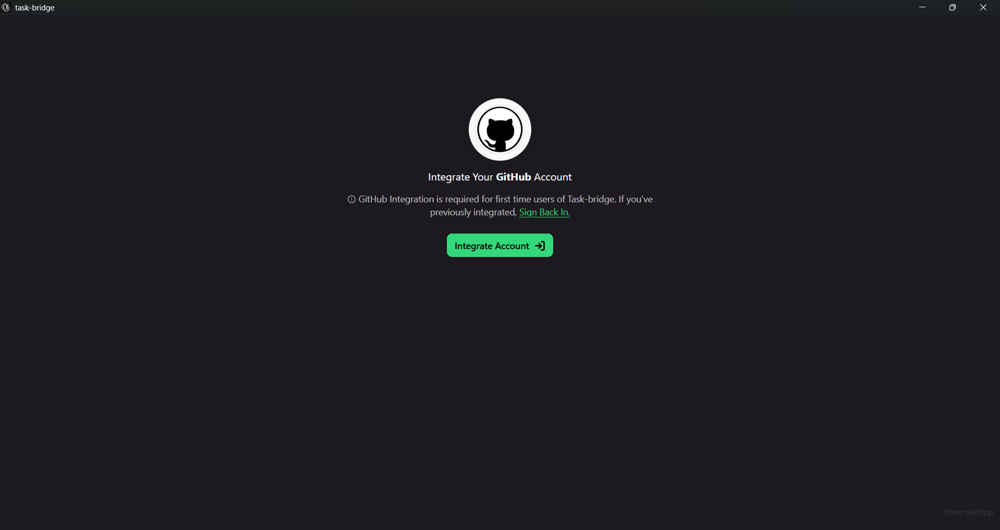
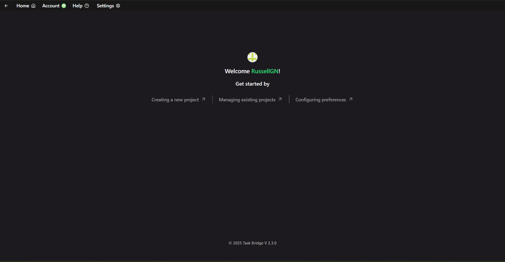

# Task-Bridge

A desktop app for simplified GitHub issues tracking & management. Designed for people needing a simpler way to stay on top of development projects without needing to be GitHub experts.

Screenshots - v2.3.0

 

<table>
  <tr>
    <td align="center" width="50%">
       
    </td>
    <td align="center" width="50%">
       
    </td>
  </tr>
  <tr>
    <td align="center">
       
    </td>
    <td align="center">
       
    </td>
  </tr>
  <tr>
    <td align="center">
       
    </td>
    <td align="center">
       
    </td>
  </tr>
  <tr>
    <td align="center">
       
    </td>
    <td align="center">
       
    </td>
  </tr>
</table>

## Usage

Task-bridge is pretty straightforward to use, but in the event you get stuck, a usage guide is available in-app under the `Help` tab.

## Download

[> Download latest](https://github.com/russellgn/task-bridge/releases/latest)  

⚠️ **Caveat**  
Always toggle `uninstall first` and `clear previous data` options if switching between versions (will be improved in future).

